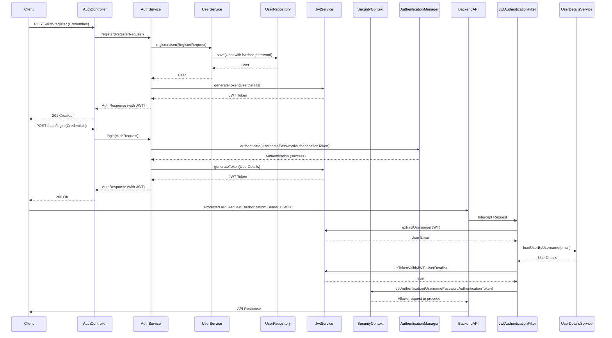

# Architecture Documentation

This document details the architectural principles, security considerations, and error handling strategies employed in the Expense Tracker application.

## Security Architecture

Security is a paramount concern for the Expense Tracker. Our architecture is designed to protect user data and ensure secure interactions. The primary authentication mechanism is JWT (JSON Web Tokens).

### Authentication Flow (UML Sequence Diagram)

### Security Layers

Our security strategy encompasses multiple layers:

*   **Network Layer:** In production, HTTPS will be strictly enforced to encrypt all data in transit, preventing eavesdropping and man-in-the-middle attacks.
*   **Application Layer:**
    *   **Authentication:** JWT-based stateless authentication ensures that each request is independently verified.
    *   **Authorization:** Access control is implemented at the service layer, ensuring users can only access and modify their own data.
    *   **Password Hashing:** Passwords are never stored in plain text but are securely hashed using BCrypt.
    *   **Input Validation:** Robust validation is applied to all incoming API requests to prevent common vulnerabilities like injection attacks.
*   **Data Layer:** MongoDB access is managed through Spring Data, providing an abstraction layer and reducing the risk of direct, insecure database interactions.
*   **Session Management:** The application is stateless, relying on JWTs rather than server-side sessions, which enhances scalability and resilience.

**Note:** Future enhancements will include implementing OAuth2 for more flexible authentication providers and integrating a rate-limiting strategy to protect against brute-force attacks and abuse.

## Error Handling & Resilience

Effective error handling is crucial for a robust API. The Expense Tracker implements a global exception handling mechanism to provide consistent and meaningful error responses to clients.

### Error Classification

Errors are generally classified and handled as follows:

*   **`BadRequestException` (HTTP 400):** Indicates client-side errors due to invalid input, business rule violations (e.g., amount <= 0, future dates), or attempts to perform disallowed actions (e.g., deleting a default category).
*   **`ResourceNotFoundException` (HTTP 404):** Signifies that the requested resource (e.g., a specific expense, category, or user) could not be found, or the authenticated user does not have access to it.
*   **`BadCredentialsException` (HTTP 401):** Specifically used for authentication failures (e.g., incorrect email or password).
*   **`Unauthorized` (HTTP 401):** Generic unauthorized access, typically when no valid JWT token is provided or the token is expired/invalid.
*   **`Internal Server Error` (HTTP 500):** Catches unexpected server-side exceptions, providing a generic error message while preventing sensitive internal details from leaking to the client.

All error responses include a clear, human-readable message to aid frontend development and debugging.

## Future Enhancements

*   **Microservices Migration:** While currently monolithic for Level-1, the layered architecture provides a clear path for future migration to a microservices-based architecture, allowing for independent scaling and development of components.
*   **AI-powered Analytics:** Integration of AI for predictive analytics, personalized budgeting recommendations, and anomaly detection in spending patterns.
*   **Advanced Dashboards & Visualizations:** Development of richer dashboards with interactive charts and graphs to provide deeper insights into financial data.

## Glossary

*   **JWT (JSON Web Token):** A compact, URL-safe means of representing claims to be transferred between two parties.
*   **Spring Boot:** A framework that simplifies the creation of stand-alone, production-grade Spring-based Applications.
*   **Spring Data MongoDB:** Provides familiar Spring interfaces for working with MongoDB, including feature-rich object-document mapping (ODM) functionality.
*   **Lombok:** A Java library that automatically plugs into your build process to auto-generate boilerplate code (like getters, setters, constructors).
*   **DTO (Data Transfer Object):** An object that carries data between processes. Used to transfer data over the network in a serialized form.

## Notes

*   **Separation of Concerns:** The layered architecture strictly enforces separation of concerns, making the codebase easier to understand, maintain, and test.
*   **Idempotency:** APIs are designed with idempotency in mind where appropriate, ensuring that repeated requests for actions like creating or updating resources do not lead to unintended side effects.
*   **Monitoring:** While not explicitly implemented in Level-1, a production-ready application would integrate comprehensive monitoring and logging solutions to track performance, identify issues, and ensure system health.
*   **Documentation:** This documentation, along with the API-specific and backend-specific READMEs, will be continuously updated to reflect the evolving state of the project.

