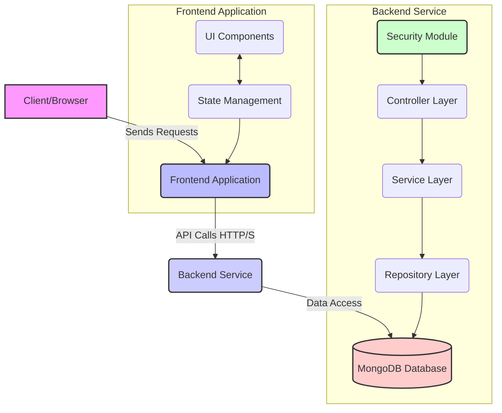

# Expense Tracker - 2025

This Expense Tracker is a modern web application designed to help individuals efficiently manage their personal finances. It provides an intuitive platform to track expenses and income, categorize spending, and gain insights into financial habits. With robust user authentication and a focus on essential features, it aims to offer a clear and predictable way to stay on top of your money.

## Tech Stack

The Expense Tracker application is built using a combination of powerful and modern technologies for both its frontend and backend components.

### Backend

Developed with Java and Spring Boot, the backend provides secure and performant REST APIs for all data management. For more in-depth technical details on the backend, including its architecture, dependencies, and API specifications, please refer to the [Backend README](./backend/README.md).

### Frontend

The frontend is a dynamic and responsive Single-Page Application (SPA) built using React with Vite. It consumes the backend APIs to provide a seamless user experience for managing expenses and viewing financial summaries. Technical details regarding the frontend will be available in its dedicated `README.md` once development progresses.

## Architecture Overview

The application follows a classic client-server architecture, with a clear separation between the frontend and backend. The frontend handles the user interface and interactions, while the backend manages business logic, data persistence, and security.

For a more detailed look into the architectural decisions, security considerations, and error handling strategies, please refer to the [Architecture Documentation](./ARCHITECTURE.md).

## Baseline Functionalities

The Expense Tracker application provides the following core features:

*   **User Authentication:** Secure user registration, login, and profile management.
*   **Expense & Income Tracking:** Record and manage daily financial transactions.
*   **Categories:** Organize transactions with custom and default categories.
*   **Monthly Summary:** View a summary of income and expenses for any given month.
*   **Filtering:** Filter expenses by month, category, and type.

## Additional Documentation

*   [Backend API Documentation](./backend/API.md)
*   [Backend Technical Details](./backend/README.md)
*   [Architecture Documentation](./ARCHITECTURE.md)

