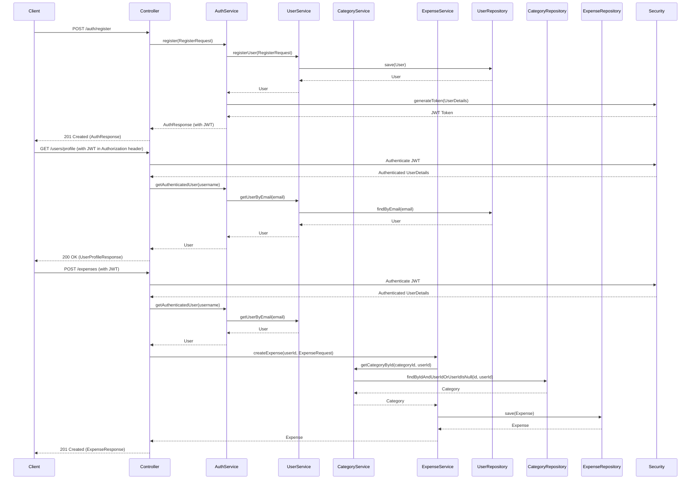

# Expense Tracker Backend API

Expense Tracker web application. Built with Java 19 and Spring Boot, it follows a monolith architecture, offering predictable REST APIs and correct MongoDB data modeling. The system is microservices-ready and designed for focusing on core functionalities.

## Completion Summary

This phase has successfully established the core backend functionalities, ensuring a solid foundation for future development:

*   **Database Schemas:** Implemented `User`, `Category`, and `Expense` MongoDB document models, including mandatory indexing strategies for `Expense.userId + date`, `Category.userId`, and `User.email (unique)`.
*   **Validation Rules:** Enforced critical business rules within the service layer, such as "Expense amount > 0", "Category must belong to the logged-in user", and "Expense date cannot be in the future".
*   **Service Layer:** Developed `UserService`, `CategoryService`, and `ExpenseService` to encapsulate all business logic, ensuring controllers remain thin and focused on HTTP concerns.
*   **Security & Middleware:** Integrated JWT-based authentication for stateless API security, protecting all non-authentication routes. Password hashing using bcrypt is applied during user registration.
*   **Error Handling:** Implemented global exception handling with meaningful HTTP status codes (e.g., 400 Bad Request, 401 Unauthorized, 404 Not Found, 500 Internal Server Error) and clear, human-readable error messages.
*   **DTOs:** Designed comprehensive Data Transfer Objects (DTOs) for request and response payloads, ensuring clean and predictable JSON communication with the frontend.
*   **API Documentation:** Integrated SpringDoc OpenAPI for generating interactive Swagger UI documentation, making all API endpoints easily explorable and testable.

## Notes

This project currently focuses solely on the backend. The following points outline current limitations and future considerations:

*   **Future Features:** Upcoming features will include reporting, AI-featured analytics, visualizations.
*   **Testing:** Manual API testing can be performed using tools like Postman or through the generated Swagger UI. Future phases will incorporate automated unit and integration tests.
*   **Deployment:** Production deployments will require HTTPS for secure communication and robust logging/monitoring solutions.

## Tech Stack

*   **Language:** Java 19+
*   **Framework:** Spring Boot 3.x
*   **Build System:** Gradle
*   **Database:** MongoDB
*   **ORM/Data Access:** Spring Data MongoDB
*   **Authentication:** JWT (JSON Web Tokens)
*   **Password Hashing:** BCrypt
*   **API Documentation:** SpringDoc OpenAPI
*   **Utility:** Lombok (for boilerplate code reduction)

## Project Structure

```
backend/
├── src/
│   ├── main/
│   │   ├── java/
│   │   │   └── com/example/expensetracker/
│   │   │       ├── config/        # Spring configurations (e.g., SecurityConfiguration)
│   │   │       ├── controller/    # REST API endpoints (thin layer)
│   │   │       ├── dto/           # Data Transfer Objects for requests/responses
│   │   │       ├── exception/     # Custom exceptions and global handler
│   │   │       ├── model/         # MongoDB document models
│   │   │       ├── repository/    # Spring Data MongoDB repositories
│   │   │       ├── security/      # JWT-related classes (service, filter)
│   │   │       └── service/       # Business logic and validation
│   │   └── resources/
│   │       └── application.properties # Application configurations
│   └── test/                      # Unit and integration tests (future)
├── build.gradle                   # Gradle build script for backend
├── settings.gradle                # Gradle settings for backend subproject
├── gradlew                        # Gradle wrapper script (Linux/macOS)
├── gradlew.bat                    # Gradle wrapper script (Windows)
└── gradle/                        # Gradle wrapper files
```

## Getting Started

### Prerequisites

*   Java Development Kit (JDK) 19+
*   MongoDB installed and running (default: `localhost:27017`)
    *   **Note:** Ensure MongoDB is accessible on the default port or update `spring.data.mongodb.port` in `backend/src/main/resources/application.properties`.

### Installation and Quick Setup

**1. Clone the repository:** (Assuming you have a parent repository, otherwise this refers to the backend's location)

```bash
# If in a monorepo setup, navigate to the backend folder
cd backend
```

**2. Build the project:**

```bash
./gradlew build
```

**3. Run the application:**

```bash
./gradlew bootRun
```

This will start the Spring Boot application on `http://localhost:8080`.

### Development

*   To run the application in development mode (with hot reloading if configured): `./gradlew bootRun`
*   To clean the project: `./gradlew clean`
*   To run tests (currently none, but for future use): `./gradlew test`

### Database

*   Ensure MongoDB is running before starting the application. The application will connect to the `expense_tracker` database by default.

## Service Architecture (Monolithic)

This backend is built as a monolith, adhering to a strict layered architecture to ensure separation of concerns, maintainability, and extensibility.

*   **`controller/`**: This layer is responsible for handling incoming HTTP requests, mapping them to appropriate service methods, and returning HTTP responses. Controllers are kept *thin*, containing no business logic. Their primary role is to act as an interface to the API.
*   **`service/`**: The heart of the application, this layer encapsulates all business logic, validation rules, and transaction management. Services interact with repositories to fetch and store data, and implement the core functionalities of the expense tracker (e.g., creating an expense, updating a user profile, fetching categories).
*   **`repository/`**: This layer provides an abstraction over the data persistence mechanism (MongoDB in this case). Repositories are responsible solely for data access operations (CRUD). They do *not* contain business logic. Spring Data MongoDB interfaces are used to simplify data access.
*   **`model/`**: This layer defines the domain objects, which are directly mapped to MongoDB documents. These classes represent the structure of data stored in the database.
*   **`dto/`**: Data Transfer Objects are used to define the shape of data exchanged between the client and the server. They decouple the internal data models from the external API contracts, providing flexibility and preventing over-exposure of internal data structures.
*   **`security/`**: This package handles all authentication and authorization concerns, specifically implementing JWT-based security. It includes the `JwtService` for token generation and validation, and `JwtAuthenticationFilter` for intercepting and processing JWTs.
*   **`exception/`**: This layer defines custom exceptions and a global exception handler. It ensures that all errors are caught and transformed into consistent, meaningful HTTP error responses, improving the API's predictability and user-friendliness.

## UML Sequence Diagram



## Additional Documentation

*   [API Documentation](./API.md)

